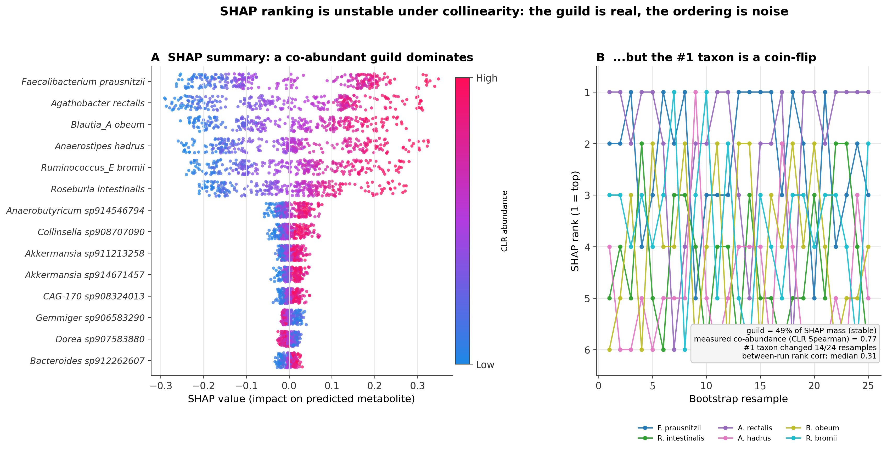

# When your #1 SHAP feature is a lie: ranking instability under collinearity

A small, fully reproducible tutorial showing a failure mode that bites constantly in
multi-omics machine learning: **when features are correlated, the *group* is stably important
but the individual SHAP ranking on top of it is close to noise.** Read off "the top SHAP
feature" as "the driver" and you will confidently name the wrong thing.

The demo runs a realistic compositional microbiome pipeline end to end, so the co-abundance
is *measured*, not assumed. Data are synthetic and species names are illustrative; the
statistical structure is real.

> **Companion guide:** the wiki page [SHAP Ranking Instability](https://github.com/axn14/Better-Bioinformatics/wiki/SHAP-Ranking-Instability) — how to detect, avoid, and learn about this mistake, with
> making defensible inferences from SHAP (precursors, workflow, troubleshooting, follow-ups).

---

## TL;DR

- Six taxa form a genuinely co-abundant guild (measured **CLR-Spearman ≈ 0.77**); everything else ≈ 0.
- A random forest predicts a metabolite from CLR-transformed taxa. The guild holds **~49% of SHAP mass**, rock steady across 25 bootstraps.
- But **which single guild member ranks #1 changes in 14 of 24 resamples**; between-run rank correlation is **0.31**.
- Lesson: report **group-level importance** and a **stability check**, not a single top feature.



---

## 1. The problem (and why I care)

Early in my MSc thesis on the colorectal-cancer microbiome, I trusted a clean SHAP top-three
and wrote those species up as the metabolite's "producers." Rerun on another fold, the top
three changed. The taxa were tightly co-abundant, and the model was simply leaning on whichever
member fit best that run. The signal was real; my *ranking* of it was not.

This repo turns that anecdote into something you can run and check.

## 2. Why this happens (the intuition)

Two mechanisms stack up:

1. **Shapley credit-sharing under correlation.** SHAP distributes a prediction's credit across
   features. When two features carry near-identical information, that credit can be split
   between them in many ways that all reconstruct the same output. Small data perturbations
   tip the split one way or the other.
2. **Arbitrary tree splits.** A tree choosing between two near-duplicate features picks one
   almost by coin-flip. Across bootstrap resamples the "winner" rotates, and the SHAP ranking
   rotates with it.

Neither is a bug. It means the **resolution** of the method is the guild, not the individual
member. The fix is to interpret at the resolution the data actually support.

## 3. The pipeline, step by step

The whole thing is in [`shap_instability_demo.py`](shap_instability_demo.py). Walkthrough:

### 3.1 Simulate a co-abundant guild (absolute abundances)
A shared latent activity `L` drives six taxa; everyone else is independent. This is what makes
the guild genuinely co-abundant rather than stipulated.
```python
L = rng.normal(size=N)                       # shared guild activity
for k in range(K):                           # 6 guild members load on L
    log_abund[:, k] = guild_base[k] + GUILD_LOADING*L + rng.normal(0, GUILD_NOISE, size=N)
# background taxa: independent, many rare
```

### 3.2 Make it compositional (real zeros)
Sequencing gives you counts under a fixed depth, not absolute abundances. We close to
proportions and draw multinomial counts, which produces authentic zeros and the sum-to-one
constraint that defines compositional data.
```python
rel = absA / absA.sum(1, keepdims=True)
counts = np.vstack([rng.multinomial(DEPTH, rel[i]) for i in range(N)])
```

### 3.3 Prevalence filter + CLR transform
Standard microbiome preprocessing: drop rarely-seen taxa, add a pseudocount, and centre-log-ratio
transform so features live in a real vector space instead of the simplex.
```python
keep = (counts > 0).mean(0) >= 0.10          # >=10% prevalence
comp = counts[:, keep] + 0.5                 # pseudocount
clr  = np.log(comp) - np.log(comp).mean(1, keepdims=True)
```

### 3.4 Measure the co-abundance (don't assume it)
Co-abundance is reported as **Spearman on CLR values** — the standard definition — so the guild
correlation is a number computed from data. Here it lands at ~0.77 within the guild, ~0.00 for
background pairs. See `figures/coabundance_check.png`.

### 3.5 Predict a metabolite and explain with SHAP
The metabolite tracks the latent guild activity `L`, so the guild is collectively predictive
while individual members are interchangeable proxies.
```python
m  = RandomForestRegressor(n_estimators=300, min_samples_leaf=3, max_features="sqrt").fit(Xc, y)
sv = shap.TreeExplainer(m).shap_values(Xc, check_additivity=False)
```

### 3.6 Bootstrap the ranks
Refit on 25 bootstrap resamples, recompute SHAP, and track how each guild member's rank moves.
The instability lives here.
```python
for b in range(B):
    idx = rng.integers(0, N, N)
    imp = np.abs(fit_shap(Xc.iloc[idx], y.iloc[idx], Xc, seed)).mean(0)
    ranks[b] = pd.Series(imp, index=names).rank(ascending=False).values
```

## 4. Results (seed = 42, reproducible)

| Quantity | Value |
|---|---|
| Taxa retained after ≥10% prevalence filter | 214 / 220 |
| Overall sparsity (zero fraction) | 18.7% |
| Measured guild co-abundance (CLR-Spearman) | **0.77** (0.73–0.79) |
| Background pair correlation | ≈ 0.00 (sd 0.06) |
| Guild share of total SHAP mass | **~49%** (stable) |
| #1 taxon identity changed | **14 / 24** resamples |
| Distinct taxa that held #1 | 4 of 6 |
| Between-run importance rank correlation | median **0.31** |

## 5. How to read the figures

- **`shap_instability_main.png`** — Panel A: a real SHAP beeswarm; the guild sits at the top,
  background taxa collapse near zero. Panel B: each guild member's rank traced across 25
  bootstraps; the lines cross constantly, and the #1 slot has no stable owner.
- **`coabundance_check.png`** — CLR-Spearman heatmap; the 6×6 guild block is deep red (~0.75),
  background is near white. This is the "the correlation is real" evidence.

## 6. Run it

```bash
pip install scikit-learn shap seaborn matplotlib numpy pandas scipy
python shap_instability_demo.py
```
Runs in ~1–2 minutes on a laptop. Regenerates all four figures and prints the summary numbers.

## 7. What to do instead

Short version: cluster correlated features and report **group importance**, then **bootstrap
the ranks** and publish the stability alongside the importance. The full checklist —including
what to verify *before* you trust SHAP at all— is in the [SHAP Ranking Instability](https://github.com/axn14/Better-Bioinformatics/wiki/SHAP-Ranking-Instability) (wiki).

## 8. Entry layout
```
mistakes/01-shap-ranking-instability/
├── README.md                 # this page (the demo write-up)
├── shap_instability_demo.py  # the whole demo (data -> CLR -> SHAP -> bootstrap -> figures)
├── requirements.txt
└── figures/
    ├── shap_instability_main.png   # 2-panel main figure
    ├── coabundance_check.png       # CLR-Spearman heatmap (co-abundance is measured)
    ├── shap_beeswarm.png           # standalone panel A
    └── shap_rank_instability.png   # standalone panel B
```
The generalizable checklist lives in the repo wiki:
[SHAP Ranking Instability](https://github.com/axn14/Better-Bioinformatics/wiki/SHAP-Ranking-Instability).
Run the demo from inside this folder (`cd mistakes/01-shap-ranking-instability`); it writes into `figures/`.

## 9. Honesty / caveats
Data are synthetic and species names are illustrative — chosen so the pane